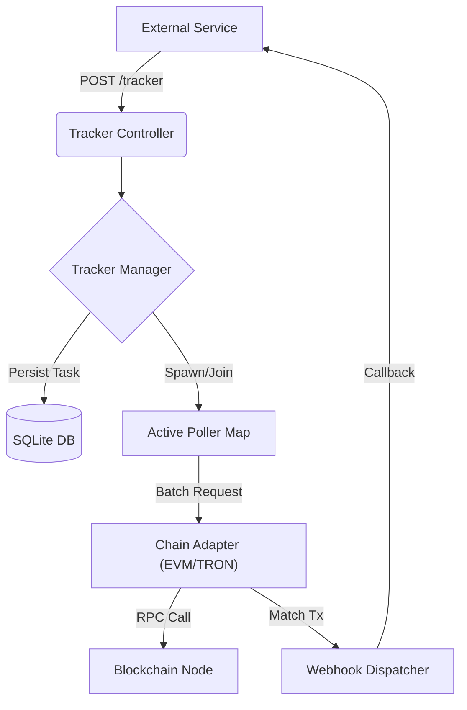

<p align="center">
  
</p>

<h1 align="center">Terminus Tracker</h1>

<p align="center">
  <strong>Next-Gen On-Chain Event Ingestion Engine</strong>
</p>

<p align="center">
  <a href="https://nodejs.org"></a>
  <a href="https://nestjs.com/"></a>
  <a href="https://www.typescriptlang.org/"></a>
  <a href="https://opensource.org/licenses/MIT"></a>
</p>

<p align="center">
  <em>"Precision Tracking. Ephemeral Architecture. Zero Overhead."</em>
</p>

---

## ⚡️ Introduction

**Terminus Tracker** is a high-performance, stateless, dynamic on-chain transaction tracking service designed for enterprise-grade crypto payment gateways and exchange deposit systems.

Unlike traditional heavy indexers that scan the entire blockchain, Terminus Tracker operates on an **"Ephemeral Scanner"** architecture. It spawns lightweight, on-demand tracking tasks triggered by external business events (e.g., "User A created a deposit order of 0.1 ETH").

### 🚀 Key Features

- **Dynamic Ephemeral Scanning**: Instantly spins up tracking tasks only when needed, reducing infrastructure costs by 90% compared to full-node indexers.
- **Smart I/O Multiplexing**: Automatically batches multiple tracking requests for the same address into a single RPC poller, maximizing throughput while staying within rate limits.
- **Crash-Safe Persistence**: Built-in WAL-mode SQLite persistence ensures zero data loss. Tasks are automatically restored and resumed upon service restart.
- **Protocol Agnostic Core**: Abstracted architecture ready for EVM, TRON, and UTXO chains.
- **Event-Driven Webhooks**: Real-time HTTP callbacks upon transaction confirmation or timeout.

---

## 🛠 Architecture

Terminus Tracker adopts a micro-kernel architecture with a focus on modularity and resilience.



### The "Ephemeral Scanner" Pattern

1.  **Request**: External system requests tracking for `Address X`, `Amount Y`.
2.  **Provision**: System checks if `Address X` is already being watched.
    *   *Yes*: The new task joins the existing poller (Multiplexing).
    *   *No*: A new lightweight poller is instantiated.
3.  **Lifecycle**: The poller runs until:
    *   Target transaction is confirmed.
    *   Timeout threshold is reached.
4.  **Disposal**: Once all tasks for an address are resolved, the poller self-terminates to free up resources.

---

## 🏁 Quick Start

### Prerequisites

- Node.js v20+
- pnpm

### Installation

```bash
$ pnpm install
```

### Configuration

Create a `.env` file in the root directory:

```bash
cp .env.example .env
```

Configure your RPC endpoints (LlamaRPC is used by default for EVM):

```env
PORT=3010
ETH_RPC_URL=https://eth.llamarpc.com
```

### Running the Application

```bash
# development
$ pnpm run start

# watch mode
$ pnpm run start:dev

# production mode
$ pnpm run start:prod
```

---

## 🔌 API Reference

### Create Tracking Task

Registers a new ephemeral tracking task.

**POST** `/tracker`

**Body:**

```json
{
  "chain": "ETH",
  "address": "0xd8dA6BF26964aF9D7eEd9e03E53415D37aA96045",
  "amount": "0.01",
  "currency": "ETH",
  "tag": "order_123456",
  "callbackUrl": "https://webhook.site/your-webhook-id",
  "timeoutSeconds": 3600
}
```

**Response:**

```json
{
  "id": "550e8400-e29b-41d4-a716-446655440000",
  "status": "PENDING",
  "createdAt": "2023-10-27T10:00:00.000Z"
}
```

---

## 📄 License

Terminus Tracker is [MIT licensed](LICENSE).
